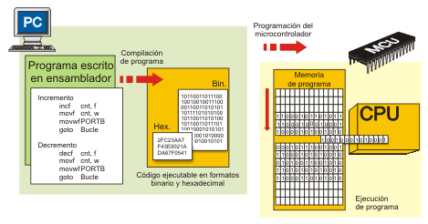

# Bienvenido/a

En el momento de crear éstos programas en Assembly, fue necesario el uso de un SO de derivación GNU/linux, es éste caso ( Linux mint ), no con ello queriendo dictar un SO específico para correrlos; sin embargo los SO de derivación GNU/linux evitan el uso de una VM para e enlace con el compilador NASM, usado en la compilación de éstos programas, y que en Windows es necesaria.

## Ilustración


## > 1.- Hola Mundo
``` nasm
section .data

msg db "hola mundo!!!",0xA,0xD
len equ $ - msg

section .text
    global _start
_start:
    
    mov eax, 4 ; llamda al sistema(sys_ write)
    ;eax= 4
    mov ebx, 1 ;stout
    mov ecx, msg ;msm _salid
    mov edx, len ; longitud msg 

    int 0x80 ; interruccion, llamada al sistema de interruciones
    mov eax, 1 ;exit
    int 0x80 ; interruccion invocada
```

~~~
El archivo contenido, explica la arquitectura de 32 bits, para la ejecución de programas en asm.

#Teoría de asm.
//pendiente redacción

#Comandos
sudo apt-get install nasm                   | Instalación del compilador nasm para asm
nasm -f elf Holamundo.asm                   | Pasar el archivo asm por el compilador de asm, que genera el .o para enviar al enlazador
ld -m elf_i386 -s -o Holamundo  Holamundo.o | Modo de enlace para registros de 32 bits= elf_i386
./Holamundo                                 | Ejecución del programa compilado
~~~

➡ [Enlace del doc.mitch](1.-holamundo/doc.mitch)

## > 2.- Automatizando El Ensamblado
~~~
Este documento contiene las rutas para omitir el proceso de terminal para enlazar y compilar un programa ams

#Teoría de asm.
/ Radica en el uso de sublime text para mediante ctrl+b poder enlazar y compilar archivos asm

#Comandos
{"cmd": ["~/run.sh ${file} ${file_base_name}"],"shell": true}	|Comando de ejecución para sublime
REF// run.sh 													|Comando bash para el proceso

#Precaución 
/Eliminar los espacios de las rutas, interfieren en la secuencia de la  bash
~~~
➡ [Enlace del doc.mitch](2.-AutomatizandoElEnsamblado/doc.mitch)

## > 3.- Masm Y Tasm
``` nasm
;masa
.model small; definiendo el tipo de model, corto (64 kb)

.data ; se definen las variables que se van a ocupar, es el segmento de los datos

mensaje db 'hola, soy mitch$'; ya no necesitamos colocar la longitud del mensaje

.code
empieza:;definimos el comienzo del cuerpo del programa, el body

mov ax,@data ;movemos el registro dx, los datos a auxiliar
mov ds,ax
	
	;en ah siempre se cargan las funciones, en este caso 09h, permite desplegar un mensaje en pantalla
mov ah,09h; 0x9 la misma instruccion
mov dx,offset mensaje; movemos el resgistro dx al contenido del mensaje

; se llama a la interrupcion 21h
int 21h

;terminamos el programa
mov ax,4c00h
int 21h

.stack;segmento de pila

end empieza;termina el segmento definido como empieza

;--------------------Microsoft Assembly----------------------------
```

``` nasm
;turbo asm o tasm

.model small; declaramos el modelo de memoria (64kb)

.stack

.data
mensaje dB 'Hola, soy mitch','$';mensaje, termina con caracter

.code 
inicio:;segmento del programa, el linker del enlazador
mov ax, @data
mov ds, ax
lea dx, mensaje
mov ah, 09h
int 21h; misma nterrucion
mov ah,4ch
int 21h
end inicio
;--------------------Retrocompatibilidad con Microsoft Assembly----------------------------

```
~~~
Este documento contiene las aclaraciones a tener en cuenta respecto a los compiladores masm y tasm

#Teoría de asm.
/ Radica en el hecho de que son compiladores para el Ms Dos, son nativos de Microsoft en el caso del masm, y el tasm es compatible

#Comandos
REF// Tasm.asm	|Codigo para dicho compilador
REF// Masm.asm	|Codigo para dicho compilador

#Precaución 
/A pesar de sus diferencias, en retrospectiva son basicamente iguales.
~~~
➡ [Enlace del doc.mitch](3.-MasmYTasm/doc.mitch)

> [LICENSE ® ](https://opensource.org/licenses/MIT) 
